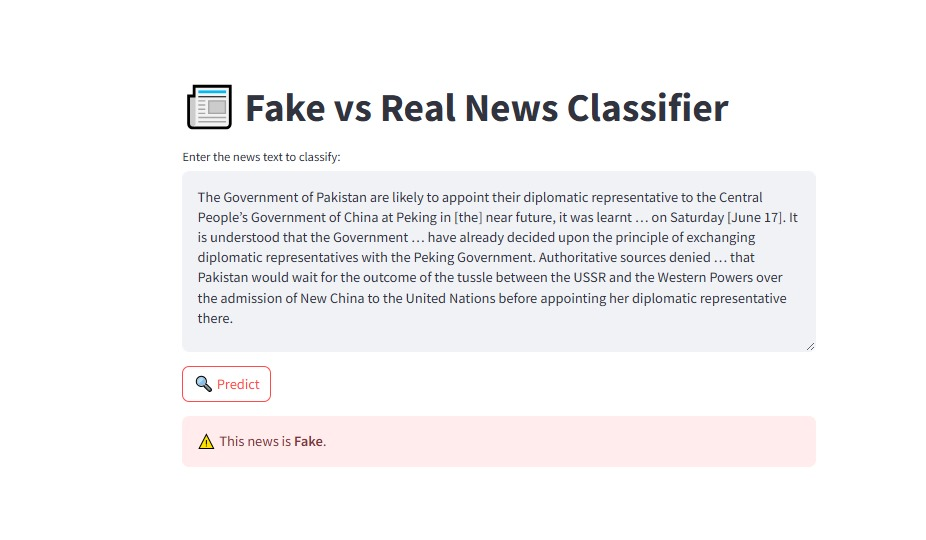

# 📰 Fake vs Real News Classifier

A Streamlit web app that classifies news articles as **Real** or **Fake** using TF-IDF vectorization and Logistic Regression, with efficient caching for fast load times.

---

## 🔑 Features

- **Text Preprocessing**
  - Cleans text to letters only, lowercases, removes stopwords, and applies Porter stemming via NLTK.
- **Vectorization**
  - Transforms preprocessed text into TF-IDF feature vectors (max 5,000 features).
- **Classification**
  - Trains a Logistic Regression model on an 80/20 train/test split.
- **Interactive UI**
  - Enter any news article in the text area and click **Predict** to see “Real” or “Fake.”
- **Caching**
  - Uses `st.cache_data` for dataset loading/vectorization and `st.cache_resource` for model training to avoid repeated work.

---



## 🚀 Tech Stack

- **Language**: Python 3.8+
- **Web Framework**: [Streamlit](https://streamlit.io/)
- **NLP**: [NLTK](https://www.nltk.org/) (stopwords & PorterStemmer)
- **ML**: [scikit-learn](https://scikit-learn.org/) (TF-IDF, LogisticRegression)
- **Data**: [pandas](https://pandas.pydata.org/)

---

## 🛠 Installation

1. **Clone the repo**
   ```bash
   git clone https://github.com/itsfarhanpk/Fake-News-Prediction.git
   cd Fake-News-Prediction
   ```
